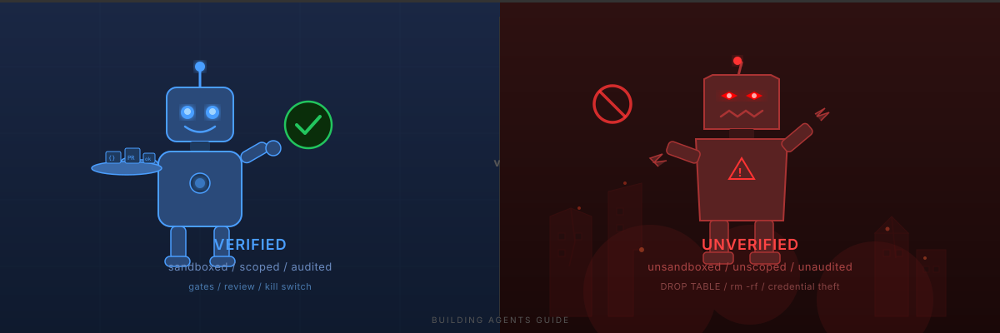

# Building Agents Guide

A practical, incident-backed guide to building autonomous AI agent infrastructure safely.

This is not theory. Every recommendation is backed by a real incident where the absence of that control caused damage, or by production practices from companies running agents at scale (Spotify, Stripe, Anthropic, OpenAI).

Works for any autonomous agent — coding agents, research agents, data pipeline agents, customer-facing agents. The harness pattern is the same. The last mile varies by type.

## Two Paths

**Consumer path (coming soon):** A setup script that installs everything and gives you a locked-down agent in under an hour. Default: the agent can do nothing. You enable capabilities one at a time. See [setup-script-requirements.md](setup-script-requirements.md) for the spec.

**Professional path (available now):** Read the guide, understand every control, customize for your risk level. Start here:

## Contents

### [How to Use the Checklist](how-to-use-the-checklist.md)
The on-ramp. You want to run an autonomous agent — here's the order of operations.

### [How to Build an Agent Harness](how-to-build-an-agent-harness.md)
Step-by-step from zero to a running sandboxed agent with output gates, human review, and full observability. Agent-type-agnostic — pair with a flavor guide for your specific agent type.

### [Flavor Guides](flavors/)
The "last mile" that varies by agent type — what credentials to use, what the review gate looks like, what output validation means:
- [Coding Agent](flavors/coding-agent.md) — PRs, CI gates, branch protection, secret detection
- [Librarian Agent](flavors/librarian-agent.md) — research fetching, citation validation, source triage

### [Attack & Risk Index](attack-risk-index.md)
Every risk an autonomous agent poses, explained in depth. 19 attack vectors across 9 categories. For each: what the attack is, a real incident, the defense, the test, and common mistakes. This is the reference encyclopedia behind the [Agent Production Readiness Checklist](https://github.com/brennhill/Delivery-Gap-Toolkit/blob/main/quality-correctness-gates/agent-production-checklist.md).

### [Setup Script Requirements](setup-script-requirements.md)
Detailed spec for the consumer-path setup script. Not the script itself — the requirements for building it.

## Who This Is For

- Engineering leaders deploying autonomous agents for the first time
- Developers building agent harnesses (sandbox, gates, permissions, review)
- Anyone evaluating whether their agent infrastructure is production-ready
- Portfolio builders who want to demonstrate they can build agent infrastructure, not just talk about it

## Related

- [Delivery Gap Toolkit](https://github.com/brennhill/Delivery-Gap-Toolkit) — the checklist, gate tooling, quick-starts, and AI policy templates
- [The Delivery Gap](https://aiaugmenteddevelopment.com) — the book on AI-assisted software delivery

## License

Apache 2.0. See [LICENSE](LICENSE).
